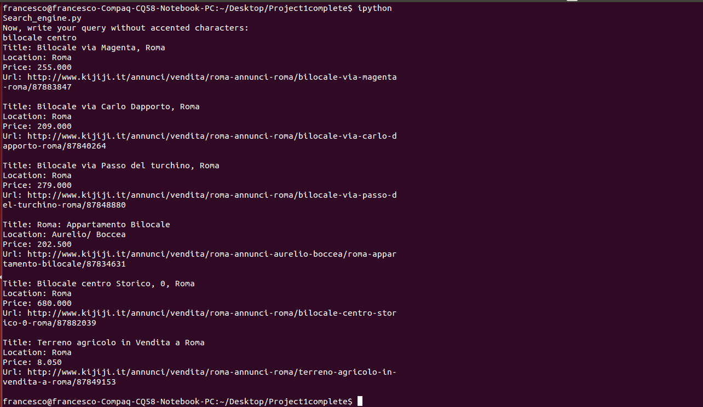
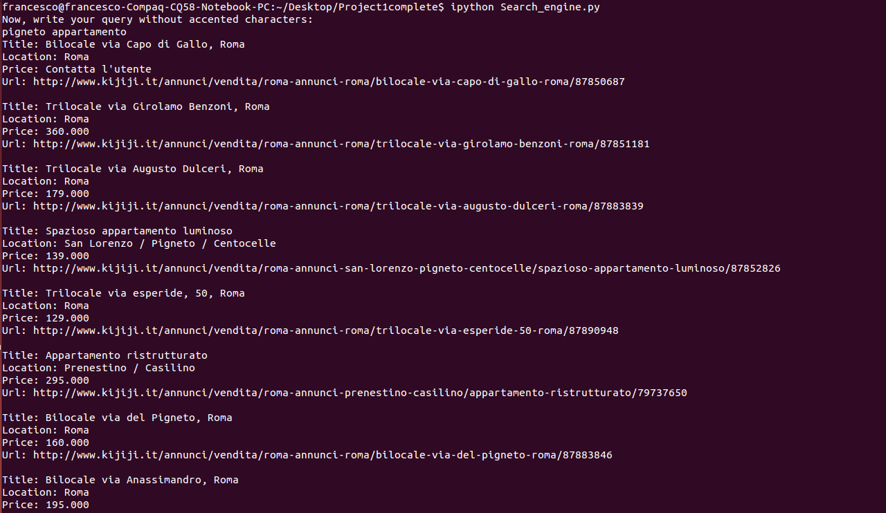
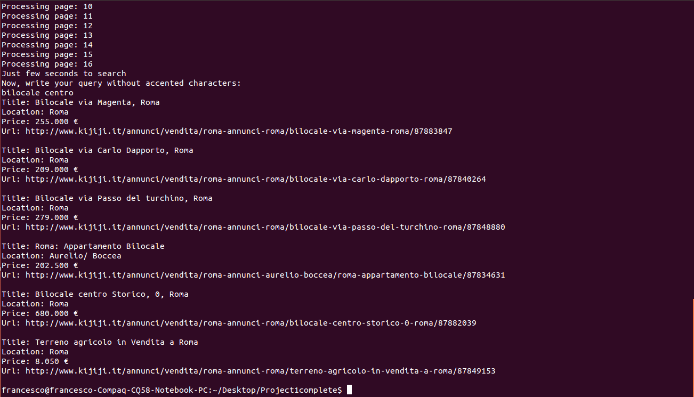

# My first SearchEngine
This is the my 1st ever academic project in Data Science. It's a simple property search engine, based on the the ads provided by the website http://kijiji.com/: in particular, we're interested only in the announcements in Rome.

## Getting Started
Simply rules to run the project on your laptop:
1. Clone the repository

2. Execute *Search_engine.py* in *src* folder

3. The instructions on the prompt will guide you through the steps (specify the size of the DB, write the query)


 **N.B.** If you want to change the number of pages, you have to move to the bin the *documents* and *index* folders,then execute again *Search_engine.py* 

## Installing

```
git clone https://github.com/FraFabbri/searchengine
```

## Screenshots

<table style="width:100%">
 <tr>
   <td></td>
 </tr>
 <tr>
   <td></td>
 </tr>
 <tr>
   <td></td>
 </tr>
</table>

